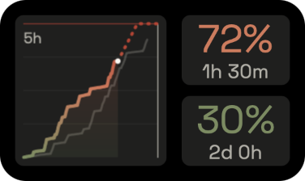
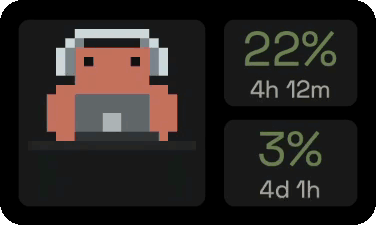
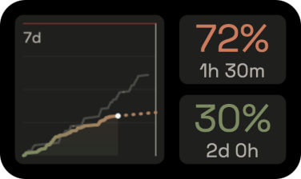
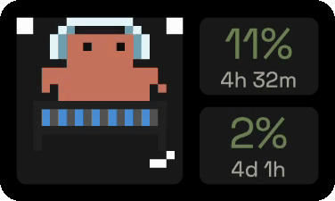
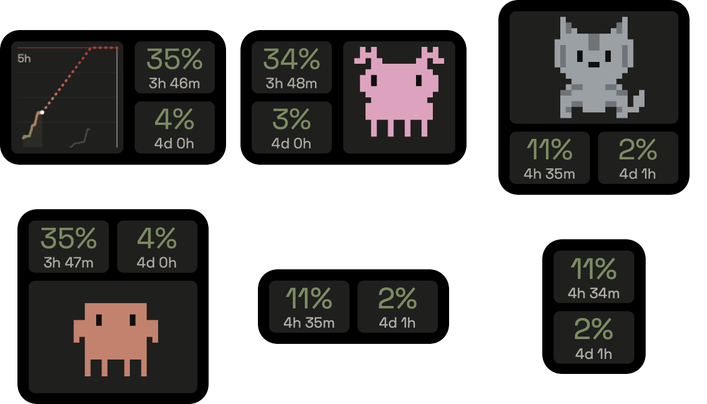

<div align="center">

# Tokometer

**A tiny desktop widget that keeps your Claude Code usage in sight — with a pixel-art coworker.**

[](https://github.com/Waddas/Tokometer/actions/workflows/ci.yml)
[](https://github.com/Waddas/Tokometer/releases/latest)
[](LICENSE)
[](https://tauri.app/)




</div>

> **Unofficial.** Tokometer is a community-built tool. It is not affiliated
> with, endorsed by, or sponsored by Anthropic. "Claude" and "Claude Code" are
> trademarks of Anthropic.

## Features

- **Live usage at a glance** — the current **5-hour** session and rolling
  **7-day** window, each with a threshold-coloured percentage and reset
  countdown, polled once a minute from your existing Claude Code login. No
  separate sign-in.
- **A mascot that works when you do** — pixel-art animations speed up with
  your usage rate. Pick **Clawd**, an **Axolotl**, or a **Cat**.
- **Usage graph with a forecast** — click the mascot to flip it into a
  usage-over-time graph: gradient-coloured history, a dotted prediction at
  your current pace, the limit ceiling, your reset time, and a faint ghost of
  the previous window for comparison.
- **Stays out of the way** — frameless, draggable, optionally pinned above
  the taskbar, hidden to the tray when you don't want it.
- **Six layouts** — mascot/graph beside, above, or below the tiles, or tiles
  only.

## Showcase

| Mascots at work | Usage graph |
| :---: | :---: |
|  |  |

| Animations follow your usage rate | Layouts |
| :---: | :---: |
|  |  |

## Controls

| Action | What it does |
| --- | --- |
| **Drag** the widget (or the ☰ handle) | Move it anywhere |
| **Click** the mascot | Flip between mascot and usage graph |
| **Right-click** the graph | Switch between the 5-hour and 7-day windows |
| **Right-click** the mascot | Pick a mascot (Clawd / Axolotl / Cat) |
| **Hover** | Reveal pin-on-top, refresh, and hide buttons |
| **Tray menu** | Show/hide, layout, mascot, pin, start at login, refresh, quit |

The tray icon doubles as a status light — its bubble turns green/amber/red
with your session usage, and the tooltip shows both live percentages.

## How it works

- **Credentials** — the poller reuses your Claude Code OAuth login, read fresh
  on every poll. On **macOS** that's the login Keychain
  (`Claude Code-credentials`); on **Windows/Linux** it's
  `~/.claude/.credentials.json` (with `%LOCALAPPDATA%`/`%APPDATA%` fallbacks).
  Nothing is stored or sent anywhere else.
- **Usage** — Anthropic's OAuth usage endpoint is polled once a minute for the
  utilization and reset time of both windows, with rate-limit headers from a
  minimal API probe as a fallback.
- **History** — the API only reports *current* utilization, so the widget
  accumulates its own time series locally (in the WebView's localStorage) to
  draw the graph: full resolution for recent hours, thinned to one sample per
  five minutes beyond that, capped at 15 days — enough for each view to show a
  ghost of its previous window.

## Install

Grab the latest installer for your platform from the
[**Releases**](https://github.com/Waddas/Tokometer/releases/latest) page:

- **macOS** — `.dmg` (universal — Intel & Apple Silicon)
- **Windows** — `.msi` or NSIS `.exe`
- **Linux** — `.AppImage`, `.deb`, or `.rpm`

Tokometer ships with an auto-updater, so you'll be prompted when a new version
is available.

> **macOS Gatekeeper / Windows SmartScreen:** the app isn't code-signed yet, so
> your OS may warn on first launch. On macOS, right-click the app → **Open**; on
> Windows, choose **More info → Run anyway**.

Prefer to build it yourself? See [Getting started](#getting-started) below.

## Getting started

### Prerequisites

- Node.js + npm
- Rust toolchain ([`rustup`](https://rustup.rs/))
- Platform build deps for Tauri — see the
  [Tauri prerequisites guide](https://tauri.app/start/prerequisites/)
  (Xcode Command Line Tools on macOS, WebView2 + MSVC build tools on Windows,
  `webkit2gtk` + friends on Linux)

### Develop

```sh
npm install
npm run tauri dev
```

Or with [Task](https://taskfile.dev/): `task install`, then `task dev`.

**Dev tips**

- Press **D** in a dev build to toggle dev mode — a small badge in the strip
  above the widget shows the current state, and leaving dev mode resets it.
  While it's on:
  - **M** toggles mocked usage data — a representative set of curves (bursts,
    plateaus, a near-limit previous window) so you can iterate on the graph
    without waiting for live history. Your real local history is untouched.
  - **A** pins the mascot to a specific animation, cycling through all of
    them and back to the automatic rate-based rotation.
- `task test` runs the frontend (Vitest) and Rust test suites; `task check`
  adds typechecking and linting.

### Build

```sh
npm run tauri build   # or: task build
```

Native installers land in `src-tauri/target/release/bundle/` — NSIS/MSI on
Windows, `.app`/`.dmg` on macOS, deb/AppImage/rpm on Linux.

## Platform notes

- **Window transparency** needs Tauri's `macos-private-api` feature on macOS
  (already configured); it is inert elsewhere. A macOS build using this
  private API cannot ship on the Mac App Store, which is fine for direct
  distribution.
- On **Windows**, a pinned widget re-asserts itself above the taskbar, which
  shares the topmost z-band.

## Contributing

Contributions are welcome — bug reports, docs, new mascots, and features alike.
See [CONTRIBUTING.md](.github/CONTRIBUTING.md) for the development workflow and
PR conventions, and please follow the
[Code of Conduct](.github/CODE_OF_CONDUCT.md). Found a security issue? See the
[Security Policy](.github/SECURITY.md).

## Credits

- Inspired by [Clawdmeter](https://github.com/HermannBjorgvin/Clawdmeter).
- The **Clawd** pixel-art is derived from the community
  [claudepix](https://claudepix.vercel.app/) set — thank you!
- Typeface: [Space Grotesk](https://fonts.google.com/specimen/Space+Grotesk)
  (SIL OFL 1.1).

## License

[MIT](LICENSE).

The bundled font and pixel-art are redistributed under their own permissive
licenses — see [THIRD_PARTY_NOTICES.md](THIRD_PARTY_NOTICES.md) and
`src/fonts/`.
