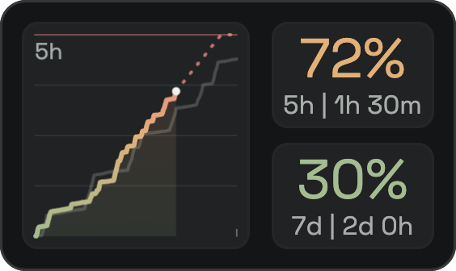

<div align="center">

# Tokometer

**Claude Code and Codex usage, always in view.**

A lightweight desktop widget for tracking usage limits, reset times, and trends without interrupting your work.

[](https://github.com/Waddas/Tokometer/actions/workflows/ci.yml)
[](https://github.com/Waddas/Tokometer/releases/latest)
[](LICENSE)
[](https://tauri.app/)



[Download](https://github.com/Waddas/Tokometer/releases/latest) · [Getting started](#getting-started) · [Development](#development) · [Report an issue](https://github.com/Waddas/Tokometer/issues)

</div>

## Overview

Tokometer keeps your coding-agent usage visible in a compact, resizable widget. It reuses your existing Claude Code or Codex login and runs from the system tray on macOS, Windows, and Linux.

- **Usage and reset times.** See session, weekly, and additional limits returned by your provider, with colour-coded percentages and reset countdowns.
- **Claude and Codex switching.** Switch from the widget when both providers are detected, or choose a provider in Settings. Each keeps its own hidden-limit preferences.
- **History and forecasts.** Follow usage over time, compare the previous window, and see a forecast based on your current pace and configured work days.
- **Flexible layouts.** Place the graph beside, above, or below your usage tiles, or use a compact tiles-only view. Resize with presets or the corner grip.
- **Controls where you want them.** Position the tools and provider buttons independently on any side. Buttons wrap on narrow widgets and stack when they share a side.
- **Desktop integration.** Pin the widget above other windows, hide it to the tray, choose a ring or percentage tray indicator, and optionally start at login.
- **Four themes.** Charcoal is the default, alongside Midnight, Paper, and Mist. The widget and settings window share your chosen theme.

## Install

Download the appropriate installer from [Releases](https://github.com/Waddas/Tokometer/releases/latest).

| Platform | Packages |
| --- | --- |
| macOS | Universal `.dmg` for Apple Silicon and Intel |
| Windows | `.msi` or NSIS `.exe` |
| Linux | `.AppImage`, `.deb`, or `.rpm` |

Releases are currently unsigned, so macOS Gatekeeper or Windows SmartScreen may display a warning on first launch. Only open installers you downloaded from this repository's release page and trust.

Tokometer checks for updates on launch and daily thereafter. An indicator on the settings button appears when an update is available; install it through Settings or the tray menu.

## Getting started

1. **Sign in to Claude Code or Codex.** Codex usage requires a ChatGPT login saved in a local `auth.json` file.
2. **Launch Tokometer and open Settings.** Select a detected provider under **Usage provider**.
3. **Choose your view.** Set the layout, size, theme, and visible limits. Click the animated display to switch it to the usage graph.
4. **Arrange the controls.** Under **Widget → Button positions**, choose a side for Tools and Providers independently.

Only the selected provider makes usage requests, normally once a minute. History builds locally while Tokometer runs; a new installation starts without historical data.

### Provider detection

A provider becomes selectable when Tokometer finds evidence of local use. Detection does **not** depend on a successful usage request, so an expired login, rate limit, or connection problem will not hide a provider.

| Provider | Local detection | Requirements for usage data |
| --- | --- | --- |
| Claude | Claude credential files, `~/.claude.json`, or the `Claude Code-credentials` macOS Keychain entry | An existing Claude Code OAuth login |
| Codex | `auth.json` in `CODEX_HOME`, or the default `.codex` directory in your home folder | A ChatGPT login using file-based credential storage |

Local detection runs at launch, each polling cycle, and on **Refresh**. The widget's Claude and ChatGPT icon buttons appear only when both providers are detected. The active provider has an accent highlight; providers that are not detected remain disabled in Settings.

Codex's integration uses local files and HTTPS, with no macOS-only dependency. On Windows, the home directory falls back to `%USERPROFILE%` when `HOME` is unset. Credentials stored only in a system credential store or a separate WSL environment are not automatically discovered. An existing but unsupported or unreadable auth file produces a usage error rather than a crash.

## Controls

Hover over the widget to reveal its buttons. The grab handle is separated from the other tools; when controls wrap, grab and close stay at the top corners and the remaining rows are centered.

| Action | Result |
| --- | --- |
| Drag the widget or grab handle | Move the widget |
| Drag the bottom-right grip | Resize the widget |
| Click a provider icon | Switch between Claude and Codex |
| Click Pin | Keep the widget above other windows |
| Click Refresh | Recheck local providers and retry usage immediately |
| Click Settings | Adjust appearance, layout, limits, controls, and startup preferences |
| Click Close | Hide the widget; restore it from the tray |
| Hover over the graph | Inspect usage and time at the cursor |
| Right-click the graph | Cycle through visible limit windows |
| Right-click a usage tile | Toggle between usage percentage and limit/reset details |

Usage tiles and the graph have no native hover tooltips. The graph retains its own cursor readout. The display also supports optional animated mascots; click it to switch between animation and graph, or right-click the animation to choose another character.

## Data and privacy

Tokometer reads existing credentials and sends usage requests directly to the selected provider. It does not require a separate Tokometer account or a hosted backend. Settings and usage history are stored locally.

### Claude

Credentials are read fresh on each poll from the macOS login Keychain or Claude credential files. File lookup includes `~/.claude/.credentials.json` and the Windows `%LOCALAPPDATA%` and `%APPDATA%` Claude directories.

The OAuth usage endpoint supplies usage and reset times. When it returns HTTP 429, automatic retries back off through 2, 4, 8, and 15 minutes, with jitter. Manual Refresh retries immediately.

**Fallback usage probe is enabled by default.** If the usage endpoint fails, Tokometer can send a minimal Messages API request with a one-token output limit and read its rate-limit headers. This consumes a small amount of Claude usage and runs at most once every five minutes while the endpoint is failing. Disable **Fallback usage probe** in Settings if you want usage-endpoint requests only.

### Codex

Tokometer reads `$CODEX_HOME/auth.json`, or `~/.codex/auth.json` by default, and queries OpenAI's internal usage endpoint directly. It does not launch the Codex CLI or an app-server, send model prompts, refresh tokens, or write to the credential file.

API-key and other non-ChatGPT login modes are not supported for subscription usage tracking. If the login expires, refresh it through Codex and then click Refresh in Tokometer. This implementation follows the direct OAuth approach documented by [CodexBar](https://github.com/steipete/CodexBar/blob/1c4650d1b421bda3f0e495e8c14b69dc1b3de81d/docs/codex-oauth.md). The endpoint is internal and may change.

### Local history

The providers report current usage, so Tokometer records its own time series in `history.json` alongside its settings. Recent samples retain full resolution; older history is reduced to five-minute intervals and retained for up to 15 days.

Claude and Codex histories are separate. Codex history is additionally partitioned by hashed account/workspace identity, so switching accounts does not combine their readings. Graphs use each window's reported duration and reset time. Failed requests retain the same account's last reading as visibly stale data.

## Troubleshooting

| Symptom | What to check |
| --- | --- |
| A provider is disabled | Confirm its local files or credentials exist, then click Refresh. For Codex, check whether `CODEX_HOME` points to a different directory. |
| Provider icons are missing | Both providers must be detected for the widget switcher to appear. Settings remains available for provider selection. |
| Login expired or unavailable | Sign in again through Claude Code or Codex, then refresh. Codex requires file-based ChatGPT credentials. |
| Usage is faded or an error appears | The reading is stale. Check the provider status in Settings, your connection, and your login. |
| The graph is empty | Leave Tokometer running to collect history; providers do not supply historical samples. |
| The widget disappeared | Restore it from the system tray. The close button hides it rather than quitting. |

## Development

### Requirements

- Node.js and npm
- The Rust toolchain via [rustup](https://rustup.rs/)
- [Tauri platform prerequisites](https://tauri.app/start/prerequisites/)
- [Task](https://taskfile.dev/) for the workflows below

```sh
npm install
task dev
```

`task dev` uses a separate application identifier, keeping its settings and history isolated from the installed app. To copy installed data into the development profile, run `task dev:seed` first.

For the standard Tauri development command, use `npm run tauri dev`; it does not use that isolated profile.

| Command | Purpose |
| --- | --- |
| `task dev:web` | Run the Vite frontend only |
| `task check` | Type-check, run Clippy, and run the frontend and Rust tests |
| `task fmt` | Format Rust source |
| `task test:e2e` | Build and run the Windows WebView2 settings-window smoke test |
| `task build` | Build native release bundles |

In development builds, **D** toggles developer mode and **M** cycles through live and sample usage states for checking graphs and error handling. Mock data does not overwrite recorded history.

Release bundles are written to `src-tauri/target/release/bundle/`. macOS transparency uses Tauri's private API support, so macOS builds are intended for direct distribution rather than the Mac App Store. Windows CI includes native tests and a settings-window smoke test; the Codex integration has been manually verified on macOS.

## Contributing and support

See [CONTRIBUTING.md](.github/CONTRIBUTING.md) for setup and PR conventions, and follow the [Code of Conduct](.github/CODE_OF_CONDUCT.md). Report bugs through [GitHub Issues](https://github.com/Waddas/Tokometer/issues) and security concerns through the [Security Policy](.github/SECURITY.md).

If Tokometer is useful to you, you can support its development through [GitHub Sponsors](https://github.com/sponsors/Waddas).

## Credits and license

Inspired by [Clawdmeter](https://github.com/HermannBjorgvin/Clawdmeter), with Codex integration informed by [CodexBar](https://github.com/steipete/CodexBar). Provider icons come from [LobeHub Icons](https://github.com/lobehub/lobe-icons), the typeface is [Space Grotesk](https://fonts.google.com/specimen/Space+Grotesk), and the Clawd artwork derives from [claudepix](https://claudepix.vercel.app/).

Tokometer is licensed under [GPL-3.0-or-later](LICENSE). Bundled assets retain their respective licenses; see [THIRD_PARTY_NOTICES.md](THIRD_PARTY_NOTICES.md).

Tokometer is an unofficial community project, unaffiliated with Anthropic or OpenAI. Product names and trademarks belong to their respective owners.
